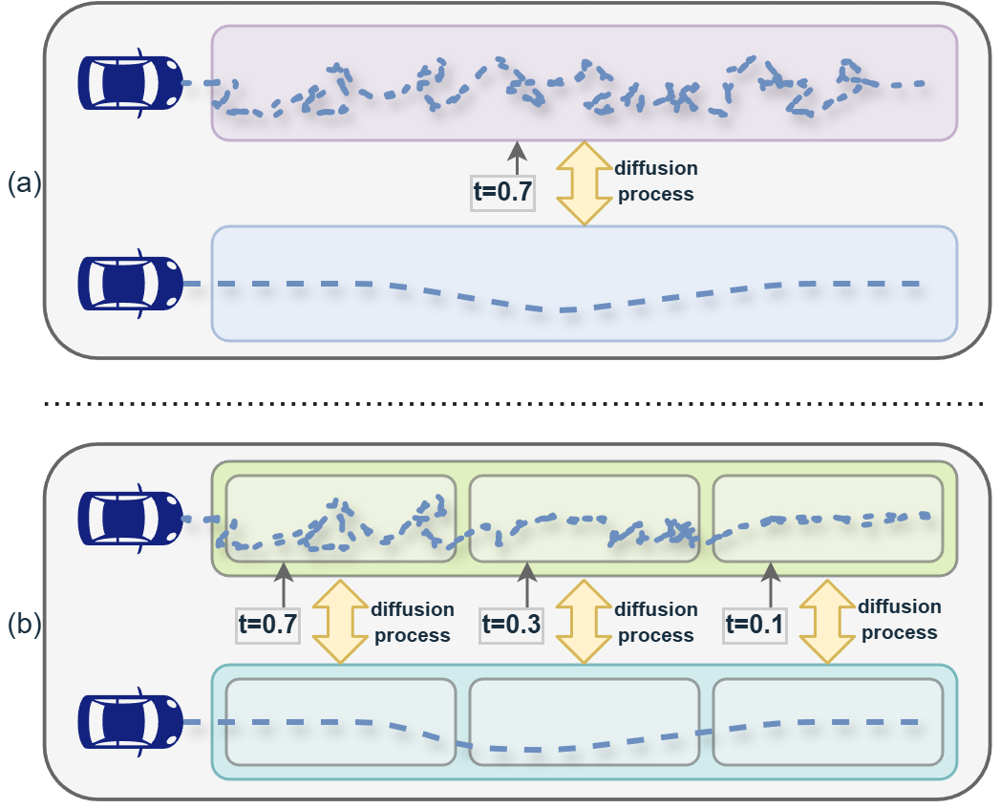
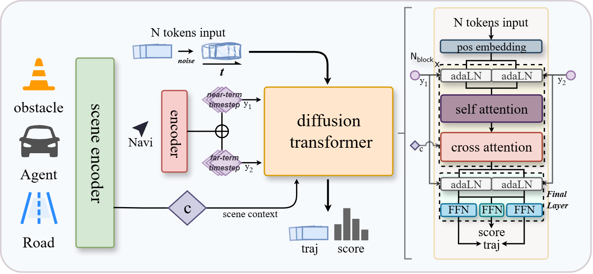

## Temporally Decoupled Diffusion Planning for Autonomous Driving

# 

#  

# 

Official implementation of the paper **"Temporally Decoupled Diffusion Planning for Autonomous Driving"**

# 

## 📖 Abstract

Motion planning in dynamic urban environments requires balancing immediate safety with long-term goals. While diffusion models effectively capture multi-modal decision-making, existing approaches treat trajectories as monolithic entities, overlooking heterogeneous temporal dependencies where near-term plans are constrained by instantaneous dynamics and far-term plans by navigational goals. To address this, we propose **Temporally Decoupled Diffusion Model (TDDM)**, which reformulates trajectory generation via a noise-as-mask paradigm. By partitioning trajectories into segments with independent noise levels, we implicitly treat high noise as information voids and weak noise as contextual cues. This compels the model to reconstruct corrupted near-term states by leveraging internal correlations with better-preserved temporal contexts. Architecturally, we introduce a **Temporally Decoupled Adaptive Layer Normalization (TD-AdaLN)** to inject segment-specific timesteps. During inference, our **Asymmetric Temporal Classifier-Free Guidance** utilizes weakly noised far-term priors to guide immediate path generation. Evaluations on the nuPlan benchmark show TDDM approaches or exceeds state-of-the-art baselines, particularly excelling in the challenging Test14-hard subset.

## 🚀 Core Methodology & Figures

### 1. Temporal Decoupling Concept
Unlike traditional full-sequence diffusion models, TDDM supports independent diffusion processes on temporal segments. 

  
   
  <em>Figure 1: Comparison of our temporal decoupled diffusion model (b) and full sequence diffusion model (a).</em>

### 2. TDDM Architecture
The architecture utilizes a Diffusion Transformer (DiT) decoder. A key innovation is the **TD-AdaLN** module, which allows the decoder to accept independent timesteps from different temporal segments.

  
   
  <em>Figure 2: Overview of the Temporally Decoupled Diffusion Model.</em>

---